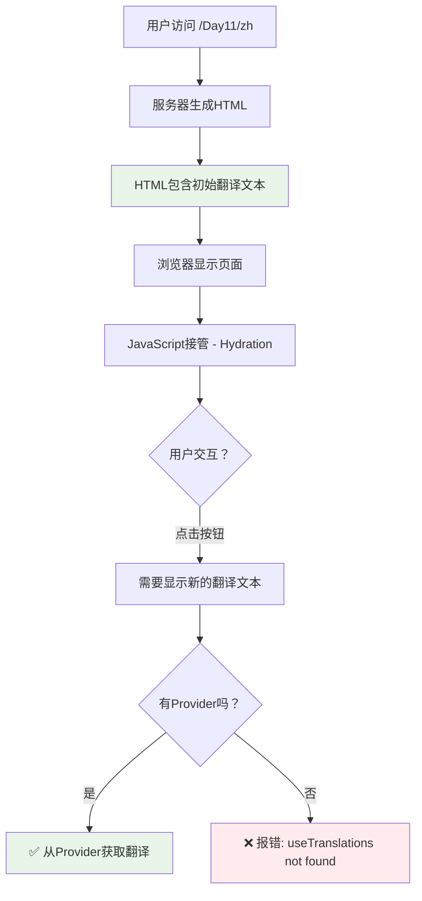
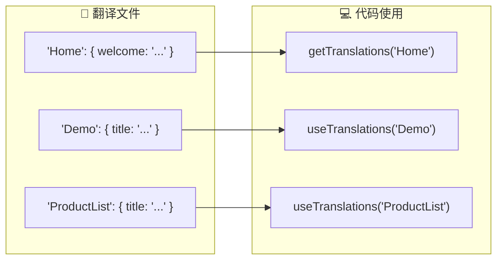
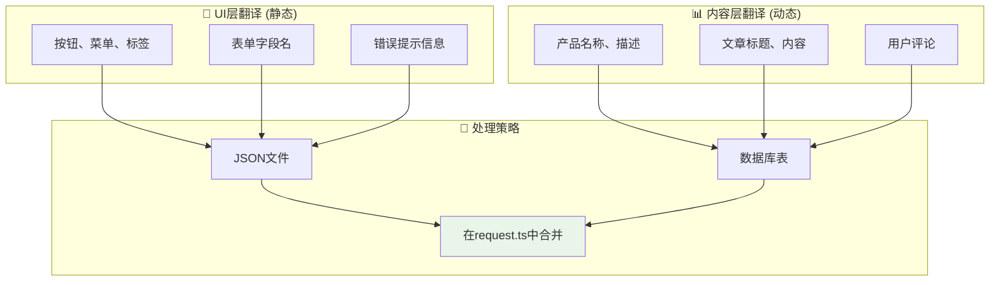

# Next.js 国际化三个核心问题完整解答

## ❓ 你的三个关键问题

1. **为什么需要Provider？** HTML不是已经包含翻译了吗？
2. **'Home'参数是什么意思？** 在哪里定义的？
3. **如果是动态数据库数据怎么办？** 不是静态JSON文件？

让我逐一详细解答：

---

## 🤔 问题1: 为什么需要 NextIntlClientProvider？

### 简短答案
**HTML确实包含初始翻译，但客户端交互需要Provider提供翻译数据！**

### 详细解释



### 实际场景对比

#### 🏗️ 服务器端组件 (不需要Provider)
```typescript
// page.tsx - 服务器端
export default async function StaticPage() {
  const t = await getTranslations('Home');
  
  return <h1>{t('welcome')}</h1>;  // ✅ 生成: <h1>欢迎使用Next.js！</h1>
}
```
**结果**: HTML直接包含翻译文本，完全静态。

#### 🎮 客户端组件 (必须要Provider)
```typescript
// InteractiveDemo.tsx - 客户端
'use client';
export default function Counter() {
  const t = useTranslations('Demo');  // ❌ 没有Provider会报错
  const [count, setCount] = useState(0);
  
  return (
    <div>
      <p>{t('clickCount', { count })}</p>  {/* 动态翻译！ */}
      <button onClick={() => setCount(c => c + 1)}>
        {t('button')}
      </button>
    </div>
  );
}
```
**问题**: 用户点击按钮时，`count`变化，需要重新生成翻译文本 "你已经点击了 5 次！"，这时必须要Provider！

### 🎯 Provider的真正作用
```typescript
// NextIntlClientProvider 做了什么？
<NextIntlClientProvider messages={messages}>
  {/* 
    将服务器端获取的翻译数据存储在React Context中
    让客户端组件通过 useTranslations() 访问
  */}
</NextIntlClientProvider>
```

---

## 📋 问题2: 'Home' 参数代表什么？

### 简短答案
**'Home' 是翻译文件中的命名空间 (Namespace)，用于组织翻译内容！**

### 翻译文件结构
```json
// src/messages/zh.json
{
  "Home": {                    👈 命名空间1
    "welcome": "欢迎使用 Next.js 国际化！",
    "feature": {
      "ssr": "✅ 服务端渲染支持"
    }
  },
  "Demo": {                    👈 命名空间2
    "title": "🎮 交互式组件演示",
    "button": "点击我"
  },
  "ProductList": {             👈 命名空间3
    "title": "产品列表",
    "addToCart": "加入购物车"
  }
}
```

### 使用方式对照


### 具体代码示例
```typescript
// 🔍 使用 'Home' 命名空间
const t = await getTranslations('Home');
t('welcome')        // → "欢迎使用 Next.js 国际化！"
t('feature.ssr')    // → "✅ 服务端渲染支持"

// 🔍 使用 'Demo' 命名空间
const demoT = useTranslations('Demo');
demoT('title')      // → "🎮 交互式组件演示"
demoT('button')     // → "点击我"
```

### 🎯 为什么要用命名空间？
1. **组织翻译内容** - 按功能/页面分类
2. **避免key冲突** - 不同模块可以有同名的key
3. **提高可维护性** - 结构清晰，易于管理

---

## 🗄️ 问题3: 动态数据库内容怎么办？

### 简短答案
**使用混合策略：静态翻译(JSON) + 动态翻译(数据库)！**

### 翻译分层架构


### 数据库设计示例
```sql
-- 产品主表
CREATE TABLE products (
  id SERIAL PRIMARY KEY,
  sku VARCHAR(50),
  price DECIMAL(10,2)
);

-- 产品翻译表
CREATE TABLE product_translations (
  id SERIAL PRIMARY KEY,
  product_id INTEGER REFERENCES products(id),
  locale VARCHAR(5),           -- 'en', 'zh'
  name VARCHAR(255),           -- 翻译后的产品名
  description TEXT,            -- 翻译后的描述
  UNIQUE(product_id, locale)
);
```

### 在 request.ts 中混合加载
```typescript
// src/i18n/request.ts
export default getRequestConfig(async ({ requestLocale }) => {
  const locale = await getCurrentLocale();
  
  // 📚 1. 加载静态翻译
  const staticMessages = (await import(`../messages/${locale}.json`)).default;
  
  // 🗄️ 2. 加载动态翻译
  const productTranslations = await loadProductTranslations(locale);
  
  // 🎯 3. 合并所有翻译
  return {
    locale,
    messages: {
      ...staticMessages,        // UI翻译
      Products: productTranslations  // 产品翻译
    }
  };
});

async function loadProductTranslations(locale: string) {
  const translations = await prisma.productTranslation.findMany({
    where: { locale }
  });
  
  // 转换为 next-intl 格式
  return translations.reduce((acc, t) => {
    acc[`product_${t.product_id}`] = {
      name: t.name,
      description: t.description
    };
    return acc;
  }, {});
}
```

### 在组件中使用
```typescript
export default function ProductList({ products }) {
  // 🎨 UI翻译 (来自JSON)
  const uiT = useTranslations('ProductList');
  
  // 📊 产品翻译 (来自数据库)
  const productT = useTranslations('Products');
  
  return (
    <div>
      <h2>{uiT('title')}</h2>  {/* 静态: "产品列表" */}
      
      {products.map(product => (
        <div key={product.id}>
          {/* 动态内容翻译 */}
          <h3>{productT(`product_${product.id}.name`)}</h3>
          <p>{productT(`product_${product.id}.description`)}</p>
          
          {/* 静态UI翻译 */}
          <button>{uiT('addToCart')}</button>
        </div>
      ))}
    </div>
  );
}
```

---

## 🎯 核心理解总结

### 1. **Provider的作用**
- HTML包含初始翻译 ✅
- 客户端交互需要Provider ✅
- 静态内容不需要，动态交互必须要 ✅

### 2. **命名空间的作用**
- 'Home'、'Demo' 是组织翻译的文件夹 ✅
- 在翻译JSON文件中定义 ✅
- 避免冲突，提高可维护性 ✅

### 3. **动态翻译的处理**
- 静态UI用JSON，动态内容用数据库 ✅
- 在request.ts中混合加载 ✅
- 同一套API，无缝使用 ✅

### 🚀 最终的完整数据流
```
1. 用户访问 /Day11/zh
2. middleware.ts 拦截请求
3. request.ts 加载翻译 (静态JSON + 动态数据库)
4. layout.tsx 通过 getMessages() 获取所有翻译
5. NextIntlClientProvider 传递给客户端
6. 页面组件使用翻译 (静态 + 动态)
7. 用户看到完整的多语言内容 🎉
```

现在你完全理解Next.js国际化的工作原理了！🎊 