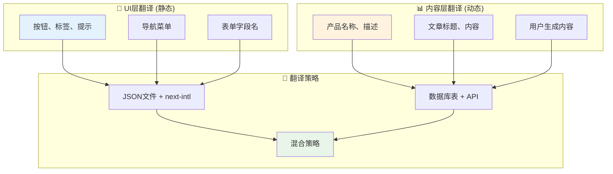

# 动态数据库内容翻译完整解决方案

## 🎯 核心问题：JSON vs 数据库翻译

现在的翻译文件是静态的：
```json
{
  "Home": {
    "welcome": "欢迎使用 Next.js 国际化！"  👈 静态文本
  }
}
```

但实际项目中，很多内容来自数据库：
```typescript
// 📊 这些数据需要多语言支持
const products = await db.products.findMany();
const articles = await db.articles.findMany(); 
const userComments = await db.comments.findMany();
```

## 🏗️ 翻译架构分层设计



## 🛠️ 解决方案1: 数据库翻译表设计

### 数据库结构
```sql
-- 产品主表
CREATE TABLE products (
  id SERIAL PRIMARY KEY,
  sku VARCHAR(50) NOT NULL,
  price DECIMAL(10,2),
  created_at TIMESTAMP DEFAULT NOW()
);

-- 产品翻译表
CREATE TABLE product_translations (
  id SERIAL PRIMARY KEY,
  product_id INTEGER REFERENCES products(id),
  locale VARCHAR(5) NOT NULL,        -- 'en', 'zh', 'fr'
  name VARCHAR(255) NOT NULL,        -- 翻译后的产品名
  description TEXT,                  -- 翻译后的描述
  UNIQUE(product_id, locale)
);
```

### 数据示例
```sql
-- 产品数据
INSERT INTO products (id, sku, price) VALUES 
(1, 'LAPTOP-001', 5999.00);

-- 翻译数据
INSERT INTO product_translations (product_id, locale, name, description) VALUES 
(1, 'en', 'Gaming Laptop Pro', 'High-performance laptop for gaming'),
(1, 'zh', '游戏笔记本专业版', '专为游戏设计的高性能笔记本电脑'),
(1, 'fr', 'Ordinateur Portable Gaming Pro', 'Ordinateur portable haute performance pour les jeux');
```

## 🔧 解决方案2: 在 request.ts 中加载动态翻译

### 增强版 i18n/request.ts
```typescript
import { getRequestConfig } from 'next-intl/server';
import { headers } from 'next/headers';
import { prisma } from '@/lib/prisma';  // 假设使用 Prisma

export default getRequestConfig(async ({ requestLocale }) => {
  // 🔍 获取当前语言
  const locale = await getCurrentLocale();
  
  // 📚 1. 加载静态翻译 (UI文本)
  const staticMessages = (await import(`../messages/${locale}.json`)).default;
  
  // 🗄️ 2. 加载动态翻译 (数据库内容)
  const dynamicMessages = await loadDynamicTranslations(locale);
  
  // 🎯 3. 合并翻译
  return {
    locale,
    messages: {
      ...staticMessages,      // 静态UI翻译
      ...dynamicMessages      // 动态内容翻译
    }
  };
});

// 🔧 动态翻译加载函数
async function loadDynamicTranslations(locale: string) {
  try {
    // 📊 从数据库加载翻译内容
    const productTranslations = await prisma.productTranslation.findMany({
      where: { locale },
      include: { product: true }
    });
    
    const articleTranslations = await prisma.articleTranslation.findMany({
      where: { locale },
      include: { article: true }
    });
    
    // 🏗️ 构建翻译对象
    const dynamicMessages = {
      Products: {},
      Articles: {}
    };
    
    // 产品翻译
    productTranslations.forEach(pt => {
      dynamicMessages.Products[`product_${pt.product_id}`] = {
        name: pt.name,
        description: pt.description
      };
    });
    
    // 文章翻译
    articleTranslations.forEach(at => {
      dynamicMessages.Articles[`article_${at.article_id}`] = {
        title: at.title,
        content: at.content
      };
    });
    
    return dynamicMessages;
    
  } catch (error) {
    console.error('Failed to load dynamic translations:', error);
    return {}; // 降级处理
  }
}
```

## 📱 解决方案3: 使用翻译的组件

### 产品列表组件
```typescript
// 🛍️ 产品展示组件
'use client';
import { useTranslations } from 'next-intl';

interface Product {
  id: number;
  sku: string;
  price: number;
}

export default function ProductList({ products }: { products: Product[] }) {
  // 🎨 UI翻译
  const uiT = useTranslations('ProductList');
  
  // 📊 产品内容翻译
  const productT = useTranslations('Products');
  
  return (
    <div>
      <h2>{uiT('title')}</h2>  {/* 静态UI: "产品列表" */}
      
      {products.map(product => (
        <div key={product.id} className="product-card">
          {/* 🗄️ 动态内容翻译 */}
          <h3>{productT(`product_${product.id}.name`)}</h3>
          <p>{productT(`product_${product.id}.description`)}</p>
          
          {/* 🎨 静态UI + 动态数据 */}
          <p>{uiT('price')}: ¥{product.price}</p>
          
          <button>{uiT('addToCart')}</button>
        </div>
      ))}
    </div>
  );
}
```

## 🚀 解决方案4: 混合策略 + 缓存优化

### Repository模式
```typescript
// 🏪 翻译仓库
class TranslationRepository {
  private cache = new Map<string, any>();
  
  // 📊 获取产品翻译
  async getProductTranslations(locale: string, productIds: number[]) {
    const cacheKey = `products_${locale}_${productIds.join(',')}`;
    
    if (this.cache.has(cacheKey)) {
      return this.cache.get(cacheKey);
    }
    
    const translations = await prisma.productTranslation.findMany({
      where: {
        locale,
        product_id: { in: productIds }
      }
    });
    
    // 🎯 转换为 next-intl 格式
    const formatted = translations.reduce((acc, t) => {
      acc[`product_${t.product_id}`] = {
        name: t.name,
        description: t.description
      };
      return acc;
    }, {});
    
    this.cache.set(cacheKey, formatted);
    return formatted;
  }
  
  // 🔄 缓存失效
  invalidateCache(pattern: string) {
    for (const key of this.cache.keys()) {
      if (key.includes(pattern)) {
        this.cache.delete(key);
      }
    }
  }
}
```

### 服务层
```typescript
// 🎯 翻译服务
class TranslationService {
  constructor(private repo: TranslationRepository) {}
  
  // 📊 获取页面所有翻译
  async getPageTranslations(locale: string, pageData: any) {
    const staticMessages = await import(`../messages/${locale}.json`);
    
    // 🔍 提取需要翻译的ID
    const productIds = pageData.products?.map(p => p.id) || [];
    const articleIds = pageData.articles?.map(a => a.id) || [];
    
    // 🗄️ 并行加载动态翻译
    const [productTranslations, articleTranslations] = await Promise.all([
      this.repo.getProductTranslations(locale, productIds),
      this.repo.getArticleTranslations(locale, articleIds)
    ]);
    
    return {
      ...staticMessages.default,
      Products: productTranslations,
      Articles: articleTranslations
    };
  }
}
```

## 🎨 解决方案5: 完整的页面实现

### 服务器端页面
```typescript
// 🏗️ 产品页面 (服务器端)
import { TranslationService } from '@/lib/translation-service';

export default async function ProductsPage({ params }: { params: { locale: string } }) {
  // 📊 获取产品数据
  const products = await prisma.product.findMany();
  
  // 🌐 获取翻译服务
  const translationService = new TranslationService();
  
  // 🎯 获取页面翻译 (静态 + 动态)
  const messages = await translationService.getPageTranslations(params.locale, { products });
  
  return (
    <NextIntlClientProvider messages={messages}>
      <ProductList products={products} />
    </NextIntlClientProvider>
  );
}
```

## 📈 性能优化策略

### 1. **分层缓存**
```typescript
// 🚀 多级缓存策略
class CachedTranslationService {
  // L1: 内存缓存 (最快)
  private memoryCache = new Map();
  
  // L2: Redis缓存 (快)
  private async getFromRedis(key: string) {
    return await redis.get(key);
  }
  
  // L3: 数据库 (慢)
  private async getFromDatabase(locale: string, ids: number[]) {
    return await prisma.productTranslation.findMany({
      where: { locale, product_id: { in: ids } }
    });
  }
}
```

### 2. **按需加载**
```typescript
// 📱 只加载当前页面需要的翻译
async function getPageTranslations(locale: string, route: string) {
  switch (route) {
    case '/products':
      return await loadProductTranslations(locale);
    case '/articles':
      return await loadArticleTranslations(locale);
    default:
      return {}; // 只返回当前页面需要的翻译
  }
}
```

## 🎯 最佳实践总结

1. **分层设计**: UI翻译用JSON，内容翻译用数据库
2. **混合策略**: 在request.ts中合并静态和动态翻译
3. **缓存优化**: 多级缓存减少数据库查询
4. **按需加载**: 只加载当前页面需要的翻译
5. **降级处理**: 翻译失败时有备用方案

这样你就可以同时支持静态UI翻译和动态内容翻译了！🎉 