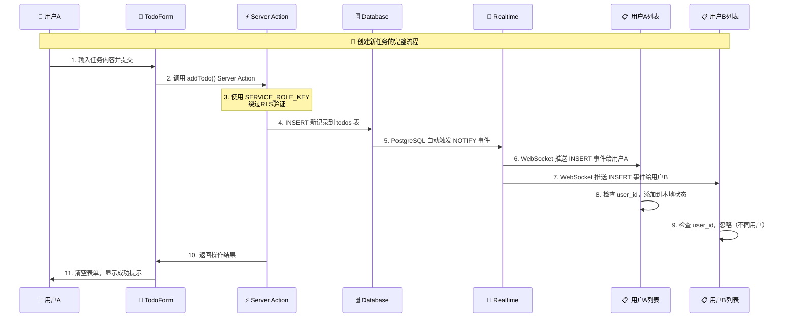

# Next.js 30天学习之旅 | Day 13 Supabase CRUD：Realtime & RLS

> **📝 今日目标**: 掌握 Next.js 15 + Supabase Realtime 实时数据同步，构建现代化协作Todo应用

---

## 📚 今日学习重点

### 🎯 核心知识点

- ✅ Supabase Realtime 实时数据库介绍
- ✅ Next.js 15 Server Actions 深度应用
- ✅ 双客户端架构设计（安全性 + 性能）
- ✅ WebSocket 实时同步机制
- ✅ PostgreSQL LISTEN/NOTIFY 原理
- ✅ React 状态管理与实时更新
- ✅ 用户体验优化和错误处理

### 🛠️ 技术栈

- **框架**: Next.js 15 (App Router + Server Actions)
- **数据库**: Supabase (PostgreSQL + Realtime)
- **实时通信**: WebSocket + PostgreSQL NOTIFY
- **状态管理**: React Hooks + 本地状态同步
- **样式**: Tailwind CSS
- **TypeScript**: 完整类型安全开发

---

## 🌟 什么是 Supabase Realtime？

### 🚀 Supabase Realtime 简介

**Supabase Realtime** 是基于 PostgreSQL 的实时数据库解决方案，提供：

- 📡 **WebSocket 连接** - 毫秒级实时双向通信
- 🔔 **数据库事件监听** - INSERT/UPDATE/DELETE 自动推送
- 🎯 **精准过滤** - 按表、用户、条件过滤事件
- 🔄 **自动重连** - 网络断开自动恢复连接
- 🛡️ **安全权限** - 基于 RLS 的数据访问控制

### 💎 为什么选择实时应用？

❌ **传统应用的限制**：

- 数据更新需要手动刷新
- 多用户协作困难
- 状态同步复杂
- 用户体验不连贯

✅ **实时应用优势**：

- 🔄 **即时同步** - 数据变化立即反映到所有客户端
- 👥 **多人协作** - 支持实时多用户同时操作
- ⚡ **零延迟感知** - 毫秒级响应提升用户体验
- 🛡️ **自动冲突解决** - 数据库层面处理并发操作

---

## 🎯 第一步：项目架构设计

### 📁 目录结构设计

```
src/app/Day13/
├── page.tsx                    # 主页面（整合TodoForm和TodoList）
├── action.ts                   # Server Actions（服务端数据操作）
├── supabase-setup.sql          # 数据库建表脚本
├── README.md                   # 项目架构说明文档
├── components/
│   ├── TodoForm.tsx            # 任务创建表单组件
│   └── TodoList.tsx            # 任务列表与实时监听
├── lib/
│   └── supabaseClient.ts       # 客户端连接配置
└── Day13-日报.md               # 今日学习日报
```

### 🏗️ 双客户端架构设计


**🔑 设计理念**：

- **客户端**: 轻量级，只负责查询和实时监听
- **服务端**: 重权限，处理所有写操作和安全验证
- **数据库**: 事件驱动，自动触发实时通知

---

## 🗄️ 第二步：数据库设计

### 创建 todos 表结构 (`supabase-setup.sql`)

```sql
-- 📋 Day13 Supabase表创建脚本
-- 在Supabase Dashboard > SQL Editor 中执行此脚本

-- 创建todos表
CREATE TABLE IF NOT EXISTS todos (
  id BIGSERIAL PRIMARY KEY,                -- 🔢 自增主键
  content TEXT NOT NULL,                   -- 📝 任务内容
  done BOOLEAN DEFAULT FALSE,              -- ✅ 完成状态
  user_id TEXT NOT NULL,                   -- 👤 用户ID（演示用字符串）
  created_at TIMESTAMPTZ DEFAULT NOW(),   -- 📅 创建时间
  updated_at TIMESTAMPTZ DEFAULT NOW()    -- 🔄 更新时间
);

-- 🚀 性能优化索引
CREATE INDEX IF NOT EXISTS idx_todos_user_id ON todos(user_id);
CREATE INDEX IF NOT EXISTS idx_todos_created_at ON todos(created_at DESC);

-- 🛡️ 行级安全策略配置
-- 开发环境暂时禁用，生产环境可启用精细权限控制
ALTER TABLE todos DISABLE ROW LEVEL SECURITY;

-- 📊 插入演示数据
INSERT INTO todos (content, user_id, done) VALUES 
  ('学习 Next.js 15 新特性', 'demo_user_example', false),
  ('掌握 Supabase Realtime', 'demo_user_example', true),
  ('构建实时协作应用', 'demo_user_example', false)
ON CONFLICT DO NOTHING;
```

💡 **数据库设计要点**：

- `BIGSERIAL` 主键支持海量数据
- `TIMESTAMPTZ` 包含时区信息，支持全球用户
- 索引优化查询性能
- RLS 策略控制数据访问权限

---

## 🔧 第三步：核心代码实现

### 0️⃣ 主页面组件 (`page.tsx`)

```typescript
// src/app/Day13/page.tsx
import TodoForm from './components/TodoForm'
import TodoList from './components/TodoList'

export const dynamic = 'force-dynamic'   // 🔄 强制动态渲染

/**
 * 📝 Day13主页面 - Realtime Todo应用
 * 
 * 功能特性：
 * 1. 🎨 整合TodoForm和TodoList组件
 * 2. 🔥 支持实时数据同步
 * 3. 🛡️ 使用Server Actions处理数据操作
 * 4. 📡 基于Supabase Realtime的WebSocket通信
 * 
 * 架构设计：
 * - 组件组合模式：将表单和列表组合成完整应用
 * - 状态提升：各组件独立管理状态，通过Realtime同步
 * - 响应式布局：使用Tailwind CSS实现现代化UI
 */
export default function Page() {
  return (
    <main className="max-w-md mx-auto p-6">
      {/* 📋 页面标题 */}
      <h1 className="text-2xl font-bold mb-4 text-center">📝 Realtime Todo</h1>
      <p className="text-gray-600 text-center mb-6">实时协作的待办事项应用</p>
      
      {/* 🏠 主要内容区域 */}
      <div className="bg-white rounded-lg shadow-sm border p-4">
        {/* 📝 任务创建表单 */}
        <TodoForm />
        
        {/* 📋 任务列表显示 */}
        <div className="mt-6">
          <TodoList />
        </div>
      </div>
      
      {/* ℹ️ 应用信息 */}
      <div className="mt-8 text-center text-sm text-gray-500">
        <p>💡 支持实时同步，多设备协作</p>
        <p className="mt-1">⚡ 基于 Next.js 15 + Supabase 构建</p>
      </div>
    </main>
  )
}
```

💡 **主页面设计要点**：

- **`export const dynamic = 'force-dynamic'`** - 禁用静态生成，确保服务端渲染
- **组件组合** - 将TodoForm和TodoList组合成完整应用
- **简洁布局** - 专注于核心功能，避免复杂的页面结构
- **响应式设计** - 使用`max-w-md`等类名确保移动端友好
- **信息架构** - 清晰的标题、表单、列表、说明层次结构

🎯 **为什么这样设计？**

1. **单一职责** - 页面只负责布局，不处理业务逻辑
2. **组件复用** - TodoForm和TodoList可以在其他页面复用
3. **维护性** - 简单的结构便于后续扩展和维护
4. **用户体验** - 清晰的视觉层次和直观的操作流程

### 1️⃣ Supabase 客户端配置 (`lib/supabaseClient.ts`)

```typescript
// 🔗 客户端连接配置
import { createClient } from '@supabase/supabase-js'

/**
 * 🎯 客户端Supabase实例
 * 
 * 特点：
 * - 使用ANON_KEY（匿名密钥）
 * - 权限受限，只能执行查询操作
 * - 支持Realtime实时监听
 * - 遵守行级安全（RLS）策略
 */
export const supabase = createClient(
  process.env.NEXT_PUBLIC_SUPABASE_URL!,      // 项目URL
  process.env.NEXT_PUBLIC_SUPABASE_ANON_KEY!  // 👥 客户端密钥
)

// 🔍 连接状态调试
console.log('🔗 客户端Supabase连接状态:')
console.log('  - URL:', process.env.NEXT_PUBLIC_SUPABASE_URL)
console.log('  - ANON_KEY存在:', !!process.env.NEXT_PUBLIC_SUPABASE_ANON_KEY)

/**
 * 📊 客户端主要用途:
 * 1. 查询数据（SELECT操作）
 * 2. 监听Realtime事件（INSERT/UPDATE/DELETE）
 * 3. 订阅数据库变化通知
 * 4. 实现用户界面的实时更新
 */
```


### 2️⃣ Server Actions 实现 (`action.ts`)

```typescript
'use server'  // 🚨 重要：标识为Server Action

import { createClient } from '@supabase/supabase-js'

/**
 * 🏗️ 服务端Supabase客户端
 * 
 * 关键特性：
 * - 使用SERVICE_ROLE_KEY（服务角色密钥）
 * - 拥有完整数据库权限
 * - 可以绕过行级安全策略
 * - 在安全的服务器环境中执行
 */
const supabase = createClient(
  process.env.NEXT_PUBLIC_SUPABASE_URL!,
  process.env.SUPABASE_SERVICE_ROLE_KEY!  // 🔐 服务端密钥
)

/**
 * 📝 新增任务 Server Action
 * 
 * @param content - 任务内容
 * @param userId - 用户ID
 * @returns 创建的任务对象
 */
export async function addTodo(content: string, userId: string) {
  console.log('🔧 Server Action: addTodo执行', { content, userId })
  
  try {
    const { data, error } = await supabase
      .from('todos')
      .insert({ 
        content,
        user_id: userId,
        done: false 
      })
      .select('*')
      .single()
    
    if (error) {
      console.error('❌ 添加任务失败:', error)
      return { data: null, error }
    }
    
    console.log('✅ 任务添加成功:', data)
    // 🔄 数据库自动触发INSERT事件，所有客户端收到实时更新
    return { data, error: null }
    
  } catch (err) {
    console.error('❌ Server Action异常:', err)
    return { data: null, error: { message: '服务器内部错误' } }
  }
}

/**
 * ✅ 切换任务状态 Server Action
 * 
 * @param id - 任务ID
 * @param done - 当前完成状态
 * @returns 更新后的任务对象
 */
export async function toggleDone(id: number, done: boolean) {
  console.log('🔄 Server Action: toggleDone执行', { id, done })
  
  try {
    const { data, error } = await supabase
      .from('todos')
      .update({ done: !done })  // 翻转状态
      .eq('id', id)
      .select('*')
      .single()
    
    if (error) {
      console.error('❌ 更新任务失败:', error)
      return { data: null, error }
    }
    
    console.log('✅ 任务状态更新成功:', data)
    // 🔄 数据库自动触发UPDATE事件
    return { data, error: null }
    
  } catch (err) {
    console.error('❌ 切换状态异常:', err)
    return { data: null, error: { message: '状态更新失败' } }
  }
}

/**
 * 🗑️ 删除任务 Server Action
 * 
 * @param id - 任务ID
 * @returns 删除操作结果
 */
export async function removeTodo(id: number) {
  console.log('🗑️ Server Action: removeTodo执行', { id })
  
  try {
    const { error } = await supabase
      .from('todos')
      .delete()
      .eq('id', id)
    
    if (error) {
      console.error('❌ 删除任务失败:', error)
      return { error }
    }
    
    console.log('✅ 任务删除成功')
    // 🔄 数据库自动触发DELETE事件
    return { error: null }
    
  } catch (err) {
    console.error('❌ 删除任务异常:', err)
    return { error: { message: '删除操作失败' } }
  }
}
```

💡 **Server Actions 核心优势**：

- 🔐 安全性：SERVICE_ROLE_KEY 不暴露给客户端
- ⚡ 性能：直接在服务器端执行，减少网络往返
- 🛡️ 权限：可绕过 RLS，执行管理员级操作
- 🔄 类型安全：TypeScript 全程类型检查


### 3️⃣ 任务创建表单 (`components/TodoForm.tsx`)

```typescript
'use client'

import { FormEvent, useState, useEffect } from 'react'
import { addTodo } from '../action'

/**
 * 📝 TodoForm组件 - 任务创建表单
 * 
 * 功能特性：
 * 1. 🎨 用户友好的输入界面
 * 2. 📤 调用Server Action提交数据
 * 3. 🔄 完整的状态管理和错误处理
 * 4. 👤 演示用户ID管理
 */
export default function TodoForm() {
  // 🏠 组件状态管理
  const [input, setInput] = useState('')
  const [userId, setUserId] = useState<string>('')
  const [isSubmitting, setIsSubmitting] = useState(false)
  const [error, setError] = useState<string>('')
  const [lastAdded, setLastAdded] = useState<string>('')

  /**
   * 👤 用户ID初始化
   * 在真实应用中，这里会从认证系统获取
   */
  useEffect(() => {
    let storedUserId = localStorage.getItem('demo_user_id')
    
    if (!storedUserId) {
      // 🆕 生成演示用户ID
      storedUserId = 'demo_user_' + Math.random().toString(36).substr(2, 9)
      localStorage.setItem('demo_user_id', storedUserId)
      console.log('🆕 创建新用户ID:', storedUserId)
    }
    
    setUserId(storedUserId)
  }, [])

  /**
   * 📤 表单提交处理
   */
  const handleSubmit = async (e: FormEvent) => {
    e.preventDefault()
    
    // ✅ 表单验证
    if (!input.trim()) {
      setError('请输入任务内容')
      return
    }
    
    if (!userId) {
      setError('用户ID未初始化')
      return
    }

    setIsSubmitting(true)
    setError('')
    
    try {
      // ⚡ 调用Server Action
      const result = await addTodo(input.trim(), userId)
      
      if (result.error) {
        setError(`添加失败: ${result.error.message}`)
      } else {
        // 🎉 成功处理
        setInput('')  // 清空表单
        setLastAdded(input.trim())
        setTimeout(() => setLastAdded(''), 3000)  // 3秒后清除成功提示
      }
    } catch (err) {
      console.error('❌ 提交异常:', err)
      setError('提交时发生未知错误')
    } finally {
      setIsSubmitting(false)
    }
  }

  return (
    <div className="space-y-4">
      <form onSubmit={handleSubmit} className="space-y-4">
        {/* 📝 任务输入框 */}
        <div className="flex gap-2">
          <input
            type="text"
            value={input}
            onChange={(e) => setInput(e.target.value)}
            placeholder="添加新任务..."
            className="flex-1 px-3 py-2 border border-gray-300 rounded-md focus:outline-none focus:ring-2 focus:ring-blue-500"
            disabled={isSubmitting}
          />
          <button
            type="submit"
            disabled={isSubmitting || !input.trim()}
            className="px-4 py-2 bg-blue-600 text-white rounded-md hover:bg-blue-700 disabled:bg-gray-400 disabled:cursor-not-allowed transition-colors"
          >
            {isSubmitting ? '添加中...' : '📝 添加'}
          </button>
        </div>
        
        {/* 👤 用户信息显示 */}
        <div className="text-xs text-gray-500">
          👤 当前用户: {userId || '加载中...'}
        </div>
      </form>

      {/* ✅ 成功提示 */}
      {lastAdded && (
        <div className="p-3 bg-green-50 border border-green-200 rounded-md">
          <p className="text-green-800 text-sm">
            ✅ 任务 "{lastAdded}" 添加成功！
          </p>
        </div>
      )}

      {/* ❌ 错误提示 */}
      {error && (
        <div className="p-3 bg-red-50 border border-red-200 rounded-md">
          <p className="text-red-800 text-sm">❌ {error}</p>
        </div>
      )}
    </div>
  )
}
```

### 4️⃣ 实时任务列表 (`components/TodoList.tsx`)

```typescript
'use client'

import { useEffect, useState } from 'react'
import { supabase } from '../lib/supabaseClient'
import { toggleDone, removeTodo } from '../action'

// 📊 Todo数据类型定义
type Todo = { 
  id: number
  content: string
  done: boolean
  user_id: string
  created_at: string
  updated_at: string
}

export default function TodoList() {
  // 🏠 组件状态管理
  const [todos, setTodos] = useState<Todo[]>([])
  const [userId, setUserId] = useState<string>('')
  const [loading, setLoading] = useState(true)
  const [showDebug, setShowDebug] = useState(false)

  /**
   * 🔄 手动刷新数据
   */
  const refreshTodos = async () => {
    if (!userId) return
    
    try {
      const { data, error } = await supabase
        .from('todos')
        .select('*')
        .eq('user_id', userId)
        .order('created_at', { ascending: false })
      
      if (error) {
        console.error('❌ 查询错误:', error)
        setTodos([])
      } else {
        setTodos(data || [])
      }
    } catch (error) {
      console.error('❌ 刷新异常:', error)
    }
  }

  /** 
   * 🚀 核心功能：初始数据加载 + 实时监听
   */
  useEffect(() => {
    // 1️⃣ 获取用户ID
    const storedUserId = localStorage.getItem('demo_user_id')
    if (!storedUserId) {
      setLoading(false)
      return
    }
    
    setUserId(storedUserId)
    
    // 2️⃣ 初始数据加载
    const loadInitialData = async () => {
      const { data, error } = await supabase
        .from('todos')
        .select('*')
        .eq('user_id', storedUserId)
        .order('created_at', { ascending: false })
      
      console.log('📊 初始数据加载:', { data, error })
      
      if (error) {
        console.error('❌ 初始加载失败:', error)
      } else {
        setTodos(data || [])
      }
      
      setLoading(false)
    }
    
    loadInitialData()
    
    // 3️⃣ 设置Realtime监听
    console.log('📡 开始设置Realtime监听...')
    
    const channel = supabase
      .channel('todos-changes')
      .on('postgres_changes', 
        { event: '*', schema: 'public', table: 'todos' },
        (payload) => {
          console.log('🔥 收到实时更新:', payload)
          
          // 📝 数据类型转换
          const newData = payload.new as Todo
          const oldData = payload.old as Todo
          
          // 4️⃣ 根据事件类型更新本地状态
          if (payload.eventType === 'INSERT' && newData.user_id === storedUserId) {
            console.log('➕ 处理INSERT事件')
            setTodos(prev => [newData, ...prev])
            
          } else if (payload.eventType === 'UPDATE' && newData.user_id === storedUserId) {
            console.log('🔄 处理UPDATE事件')
            setTodos(prev => prev.map(todo => 
              todo.id === newData.id ? newData : todo
            ))
            
          } else if (payload.eventType === 'DELETE') {
            console.log('🗑️ 处理DELETE事件')
            setTodos(prev => prev.filter(todo => todo.id !== oldData.id))
          }
        }
      )
      .subscribe((status) => {
        console.log('📡 Realtime订阅状态:', status)
      })
    
    // 5️⃣ 组件卸载时清理连接
    return () => {
      console.log('🧹 清理Realtime连接')
      supabase.removeChannel(channel)
    }
  }, [])

  /**
   * ✅ 切换任务状态
   */
  const handleToggle = async (id: number, done: boolean) => {
    try {
      const result = await toggleDone(id, done)
      if (result.error) {
        console.error('❌ 状态切换失败:', result.error)
        alert(`操作失败: ${result.error.message}`)
      }
      // ✅ 成功时不需要手动更新状态，Realtime会自动处理
    } catch (error) {
      console.error('❌ 切换异常:', error)
      alert('操作时发生错误')
    }
  }

  /**
   * 🗑️ 删除任务
   */
  const handleDelete = async (id: number) => {
    if (!confirm('确定要删除这个任务吗？')) return
    
    try {
      const result = await removeTodo(id)
      if (result.error) {
        console.error('❌ 删除失败:', result.error)
        alert(`删除失败: ${result.error.message}`)
      }
      // ✅ 成功时Realtime会自动更新列表
    } catch (error) {
      console.error('❌ 删除异常:', error)
      alert('删除时发生错误')
    }
  }

  // 🔄 加载状态
  if (loading) {
    return (
      <div className="flex items-center justify-center py-8">
        <div className="animate-spin rounded-full h-6 w-6 border-b-2 border-blue-600"></div>
        <span className="ml-2 text-gray-600">加载中...</span>
      </div>
    )
  }

  return (
    <div className="space-y-4">
      {/* 📊 列表头部 */}
      <div className="flex items-center justify-between">
        <h2 className="text-lg font-semibold text-gray-900">
          📋 任务列表 ({todos.length})
        </h2>
        <div className="flex gap-2">
          <button
            onClick={refreshTodos}
            className="px-3 py-1 text-sm bg-gray-100 hover:bg-gray-200 rounded-md transition-colors"
          >
            🔄 刷新
          </button>
          <button
            onClick={() => setShowDebug(!showDebug)}
            className="px-3 py-1 text-sm bg-blue-100 hover:bg-blue-200 rounded-md transition-colors"
          >
            {showDebug ? '隐藏' : '显示'} 调试
          </button>
        </div>
      </div>

      {/* 🔍 调试信息 */}
      {showDebug && (
        <div className="p-3 bg-gray-50 rounded-md text-sm">
          <div>👤 用户ID: {userId}</div>
          <div>📊 任务数量: {todos.length}</div>
          <div>⏰ 最后更新: {new Date().toLocaleTimeString()}</div>
        </div>
      )}

      {/* 📋 任务列表 */}
      {todos.length === 0 ? (
        <div className="text-center py-8 text-gray-500">
          📝 还没有任务，添加一个开始吧！
        </div>
      ) : (
        <div className="space-y-2">
          {todos.map((todo) => (
            <div
              key={todo.id}
              className={`flex items-center gap-3 p-3 border rounded-md transition-colors ${
                todo.done 
                  ? 'bg-green-50 border-green-200' 
                  : 'bg-white border-gray-200'
              }`}
            >
              {/* ✅ 完成状态按钮 */}
              <button
                onClick={() => handleToggle(todo.id, todo.done)}
                className={`flex-shrink-0 w-5 h-5 rounded-full border-2 flex items-center justify-center transition-colors ${
                  todo.done
                    ? 'bg-green-500 border-green-500 text-white'
                    : 'border-gray-300 hover:border-green-400'
                }`}
              >
                {todo.done && '✓'}
              </button>

              {/* 📝 任务内容 */}
              <span
                className={`flex-1 ${
                  todo.done 
                    ? 'line-through text-gray-500' 
                    : 'text-gray-900'
                }`}
              >
                {todo.content}
              </span>

              {/* 📅 创建时间 */}
              <span className="text-xs text-gray-400">
                {new Date(todo.created_at).toLocaleString('zh-CN')}
              </span>

              {/* 🗑️ 删除按钮 */}
              <button
                onClick={() => handleDelete(todo.id)}
                className="flex-shrink-0 text-red-500 hover:text-red-700 transition-colors"
              >
                🗑️
              </button>
            </div>
          ))}
        </div>
      )}
    </div>
  )
}
```

🎯 **实时监听核心机制**：

1. **WebSocket连接**: `supabase.channel()` 建立持久连接
2. **事件监听**: 监听 `postgres_changes` 事件
3. **状态同步**: 根据事件类型（INSERT/UPDATE/DELETE）更新本地状态
4. **用户过滤**: 只处理当前用户相关的数据变化
5. **连接管理**: 组件卸载时自动清理连接


---

## 🎯 第四步：完整数据流程

## 🏗️ 系统整体架构图


### 🔄 实时同步完整流程



### 📊 实时同步的高级特性


---

## 🤔 常见问题 QA

### Q1: 为什么实时更新不生效？

**A:** 排查步骤：

1. 检查 Supabase Realtime 是否启用
2. 确认 `postgres_changes` 事件监听配置正确
3. 验证表名和 schema 是否匹配
4. 查看浏览器网络面板 WebSocket 连接状态

```typescript
// ✅ 正确的监听配置
const channel = supabase
  .channel('todos-changes')
  .on('postgres_changes', {
    event: '*',           // 监听所有事件
    schema: 'public',     // 确保schema正确
    table: 'todos'        // 确保表名正确
  }, handleChange)
  .subscribe()
```

### Q2: 多个用户数据混乱怎么办？

**A:** 数据过滤策略：

```typescript
// 🎯 客户端过滤
if (payload.eventType === 'INSERT' && newData.user_id === currentUserId) {
  setTodos(prev => [newData, ...prev])
}

// 🛡️ 服务端过滤（更安全）
const channel = supabase
  .channel('user-todos')
  .on('postgres_changes', {
    event: '*',
    schema: 'public',
    table: 'todos',
    filter: `user_id=eq.${userId}`  // 只监听当前用户
  }, handleChange)
```

### Q3: 网络断开重连如何处理？

**A:** Supabase 自动重连机制：

```typescript
// 📡 监听连接状态
const channel = supabase
  .channel('todos')
  .on('postgres_changes', {}, handleChange)
  .subscribe((status) => {
    console.log('连接状态:', status)
    if (status === 'SUBSCRIBED') {
      console.log('✅ 实时连接已建立')
    } else if (status === 'CHANNEL_ERROR') {
      console.log('❌ 连接错误，自动重试中...')
    }
  })
```

### Q4: Server Actions 调用失败怎么处理？

**A:** 完善的错误处理：

```typescript
const handleSubmit = async () => {
  try {
    const result = await addTodo(content, userId)
    
    if (result.error) {
      // 🚨 服务端返回的业务错误
      setError(`操作失败: ${result.error.message}`)
    } else {
      // ✅ 操作成功
      setInput('')
    }
  } catch (err) {
    // 🔥 网络错误或其他异常
    console.error('调用异常:', err)
    setError('网络错误，请稍后重试')
  }
}
```

### Q5: 如何优化大量数据的性能？

**A:** 性能优化策略：

```typescript
// 1️⃣ 分页加载
const { data } = await supabase
  .from('todos')
  .select('*')
  .eq('user_id', userId)
  .order('created_at', { ascending: false })
  .range(0, 49)  // 只加载前50条

// 2️⃣ 虚拟滚动（大列表）
import { FixedSizeList as List } from 'react-window'

// 3️⃣ 防抖更新
const debouncedUpdate = useMemo(
  () => debounce((todos) => setTodos(todos), 100),
  []
)
```

---


## 📈 今日收获总结

### ✅ 掌握技能

- [x] Supabase Realtime 实时数据库应用
- [x] Next.js 15 Server Actions 深度实践
- [x] 双客户端架构设计和实现
- [x] WebSocket 实时通信机制
- [x] PostgreSQL 事件驱动编程
- [x] React 状态管理与性能优化
- [x] 用户体验设计和错误处理

### 🎯 关键要点

1. **双客户端架构** - 安全性与性能的完美平衡
2. **实时同步机制** - WebSocket + PostgreSQL NOTIFY 的强大组合
3. **Server Actions** - 简化服务端逻辑，提升开发效率
4. **状态管理** - 本地状态与数据库状态的实时同步
5. **用户体验** - 加载状态、错误处理、乐观更新

### 🔄 数据流程掌握

```
👤 用户操作 → 📝 组件状态 → ⚡ Server Action → 
🗄️ 数据库更新 → 📡 Realtime事件 → 🔄 自动状态同步 → 
🖼️ UI更新 → 👤 用户看到结果
```

### 🔮 明天预告

**Day 14: Creem 订阅支付：计划 / Checkout**

---

# 🌱 上岸邀请

订阅专栏「每天 10 分钟掌上岸 Next.js」，实战陪跑＋源码共享！

**Github代码地址**：[wayToNextJs](https://github.com/zhanghanting/wayToNextJs.git)

---


 #NextJS #Supabase #Realtime #ServerActions #全栈开发 #实时应用  