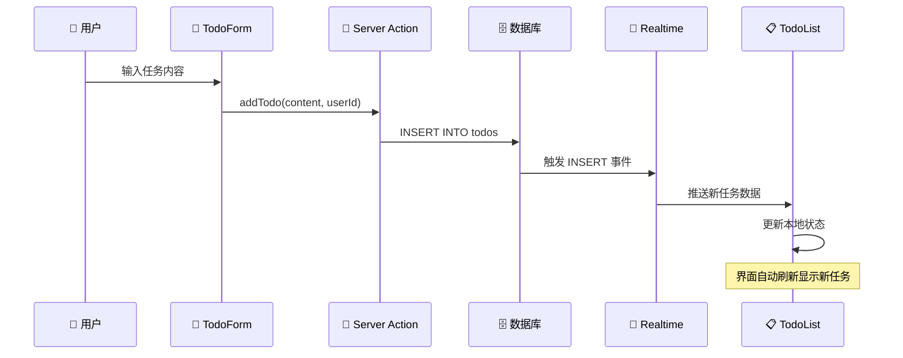
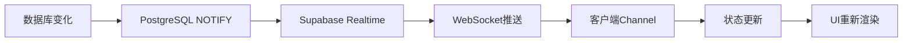

# 📝 Day13 - Realtime Todo 应用架构详解

## 🎯 概述

这是一个基于 **Next.js 15** + **Supabase** 的实时Todo应用，展示了现代全栈开发的核心概念：
- 🔥 **实时数据同步**
- 🛡️ **Server Actions**
- 📡 **WebSocket通信**
- 🏗️ **现代React架构**

## 🏗️ 系统架构

```
┌─────────────────────────────────────────────────────────┐
│                     用户界面层                          │
│  ┌─────────────┐              ┌─────────────┐          │
│  │ TodoForm.tsx│              │TodoList.tsx │          │
│  │   (输入)    │              │   (展示)    │          │
│  └─────────────┘              └─────────────┘          │
└─────────────────────────────────────────────────────────┘
           │                              │
           │ Server Actions               │ Supabase Client
           │                              │
┌─────────────────────────────────────────────────────────┐
│                     应用逻辑层                          │
│  ┌─────────────┐              ┌─────────────┐          │
│  │ action.ts   │              │supabaseClient│          │
│  │(服务器操作) │              │    (客户端)  │          │
│  └─────────────┘              └─────────────┘          │
└─────────────────────────────────────────────────────────┘
           │                              │
           │ Service Role Key             │ Anon Key
           │                              │
┌─────────────────────────────────────────────────────────┐
│                   Supabase 数据库                       │
│  ┌─────────────┐              ┌─────────────┐          │
│  │   todos表   │◄────────────►│ Realtime    │          │
│  │  (数据存储) │              │  (实时事件)  │          │
│  └─────────────┘              └─────────────┘          │
└─────────────────────────────────────────────────────────┘
```

## 📋 文件结构和职责

### 📁 目录结构
```
src/app/Day13/
├── page.tsx                 # 主页面（组合TodoForm和TodoList）
├── action.ts               # Server Actions（服务器端数据操作）
├── supabase-setup.sql      # 数据库表创建脚本
├── components/
│   ├── TodoForm.tsx        # 任务创建表单
│   ├── TodoList.tsx        # 任务列表展示
│   └── DebugPanel.tsx      # 调试面板
└── lib/
    └── supabaseClient.ts   # 客户端数据库连接
```

### 🎯 文件职责详解

| 文件 | 主要职责 | 关键技术 |
|------|---------|----------|
| `page.tsx` | 页面布局和组件组合 | React Server Components |
| `TodoForm.tsx` | 用户输入处理 | React Hooks, 表单处理 |
| `TodoList.tsx` | 数据展示和实时监听 | Supabase Realtime |
| `action.ts` | 服务器端数据操作 | Server Actions, 数据库写入 |
| `supabaseClient.ts` | 客户端数据库连接 | Supabase SDK |

## 🔄 数据流程详解

### 1. 📝 创建任务流程


### 2. 🔄 实时同步机制


## 🌐 Supabase Channel 机制深度解析

### 📡 Channel 工作原理

```javascript
// 1. 创建频道
const channel = supabase.channel('public:todos')

// 2. 监听数据库变化
.on('postgres_changes', {
  event: '*',           // 监听所有事件类型
  schema: 'public',     // 数据库模式  
  table: 'todos'        // 目标表
}, payload => {
  // 3. 处理事件
  console.log('收到事件:', payload)
})

// 4. 订阅频道
.subscribe()
```

### 🎯 事件类型处理

| 事件类型 | 触发时机 | payload.new | payload.old | 处理逻辑 |
|---------|---------|-------------|-------------|----------|
| `INSERT` | 创建新记录 | ✅ 新数据 | ❌ 无 | 添加到列表顶部 |
| `UPDATE` | 修改现有记录 | ✅ 新数据 | ✅ 旧数据 | 更新对应项目 |
| `DELETE` | 删除记录 | ❌ 无 | ✅ 旧数据 | 从列表移除 |

### 🔍 用户过滤机制

```javascript
// 只处理当前用户的数据变化
if (payload.eventType === 'INSERT' && newData.user_id === currentUserId) {
  setTodos(currentTodos => [newData, ...currentTodos])
}
```

## 🛡️ 安全模型

### 🔐 双客户端设计

```
┌─────────────────┬──────────────────┬──────────────────┐
│     特性        │   客户端连接     │   服务端连接     │
├─────────────────┼──────────────────┼──────────────────┤
│ 环境变量        │ ANON_KEY         │ SERVICE_ROLE_KEY │
│ 权限级别        │ 受RLS限制        │ 完整数据库权限   │
│ 使用场景        │ 查询、监听       │ 写入、删除、更新 │
│ 暴露风险        │ 可公开           │ 必须保密         │
│ 执行环境        │ 浏览器           │ Node.js服务器    │
└─────────────────┴──────────────────┴──────────────────┘
```

### 🎯 为什么这样设计？

1. **🔒 安全性**：敏感操作在服务端执行，客户端无法直接修改关键数据
2. **⚡ 性能**：客户端专注UI，服务端专注业务逻辑
3. **🎯 职责分离**：明确的边界和责任
4. **🔄 可扩展性**：支持多种客户端类型

## 🚀 核心技术特性

### 1. Server Actions
```javascript
'use server'  // 声明为服务器函数

export async function addTodo(content: string, userId: string) {
  // 在Node.js环境中执行
  // 可访问完整的环境变量
  // 拥有完整的数据库权限
}
```

### 2. Realtime Subscriptions
```javascript
supabase
  .channel('todos')
  .on('postgres_changes', { ... }, (payload) => {
    // 实时接收数据库变化
    // 自动更新本地状态
  })
  .subscribe()
```

### 3. React 状态管理
```javascript
const [todos, setTodos] = useState([])

// 响应式更新
useEffect(() => {
  // 监听数据变化
  // 自动重新渲染
}, [dependency])
```

## 🔧 开发环境配置

### 1. 环境变量设置
```bash
# .env.local
NEXT_PUBLIC_SUPABASE_URL=your_supabase_url
NEXT_PUBLIC_SUPABASE_ANON_KEY=your_anon_key
SUPABASE_SERVICE_ROLE_KEY=your_service_role_key
```

### 2. 数据库表创建
```sql
-- 执行 supabase-setup.sql 中的脚本
CREATE TABLE todos (
  id BIGSERIAL PRIMARY KEY,
  content TEXT NOT NULL,
  done BOOLEAN DEFAULT FALSE,
  user_id TEXT NOT NULL,
  created_at TIMESTAMPTZ DEFAULT NOW()
);

-- 暂时禁用RLS（开发环境）
ALTER TABLE todos DISABLE ROW LEVEL SECURITY;
```

## 🎯 学习要点

### 1. **Realtime机制理解**
- WebSocket连接的建立和维护
- 事件类型的区分和处理
- 用户数据的过滤逻辑

### 2. **Server Actions应用**
- 服务器端函数的定义和调用
- 安全性和权限管理
- 错误处理和用户反馈

### 3. **React状态管理**
- useEffect的依赖管理
- 状态更新的时机选择
- 组件间的数据流动

### 4. **现代全栈架构**
- 客户端/服务端职责分离
- 实时数据同步策略
- 安全性最佳实践

## 🚀 扩展方向

1. **用户认证系统**：集成Supabase Auth
2. **权限管理**：基于RLS的细粒度权限控制
3. **离线支持**：PWA和本地存储
4. **性能优化**：虚拟列表、懒加载
5. **协作功能**：多用户实时编辑、评论系统

## 💡 最佳实践总结

1. **🔄 状态管理**：使用useEffect正确管理依赖
2. **🛡️ 安全设计**：敏感操作必须在服务端执行
3. **📡 实时通信**：合理使用Supabase Realtime
4. **🎯 用户体验**：提供加载状态和错误反馈
5. **🧹 资源清理**：正确处理WebSocket连接

---

通过这个应用，您可以深入理解现代React全栈开发的核心概念和最佳实践！🎉 